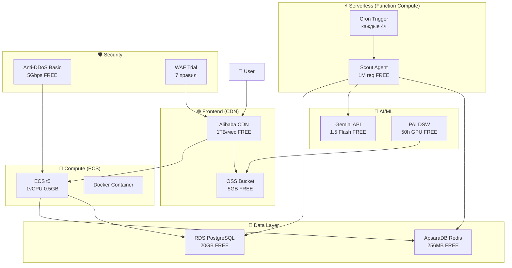

# 🏗️ Alibaba Cloud Infrastructure — Полный Гайд

## 📐 Архитектура Системы



---

## 📁 Структура Cloud Infrastructure

```
cloud/
├── config.py                 # Конфигурация (credentials, endpoints)
├── functions/
│   └── scout/
│       └── handler.py        # Function Compute агент
├── database/
│   ├── schema.sql            # PostgreSQL схема (5 таблиц)
│   └── client.py             # Python ORM клиент
├── deployment/
│   └── deployer.py           # OSS + CDN + ECS автоматизация
├── pai/
│   └── trainer.py            # ML обучение (Dr. Plant)
└── security/
    └── manager.py            # WAF + Anti-DDoS + SSL
```

---

## 🚀 Пошаговая Настройка

### Шаг 1: Создание аккаунта Alibaba Cloud

1. Регистрация: https://www.alibabacloud.com/
2. Верификация (паспорт/карта)
3. Активация Free Tier
4. Получение Access Key ID + Secret

### Шаг 2: Настройка окружения

```bash
# Установка зависимостей
pip install alibabacloud-fc-open20210406 alibabacloud-oss20190517 \
            alibabacloud-cdn20180510 alibabacloud-ecs20140526 \
            redis psycopg2-binary google-generativeai

# Переменные окружения
export ALIBABA_ACCESS_KEY_ID="your_key"
export ALIBABA_ACCESS_KEY_SECRET="your_secret"
export ALIBABA_REGION="ap-southeast-1"
export GEMINI_API_KEY="your_gemini_key"
```

### Шаг 3: Создание RDS PostgreSQL

```bash
# В консоли Alibaba Cloud:
# 1. RDS → Create Instance → PostgreSQL 14
# 2. Выбрать: db.t3.small (Free Tier)
# 3. Storage: 20GB
# 4. Region: Singapore

# Применение схемы
psql -h $ALIBABA_PG_HOST -U $ALIBABA_PG_USER -d uz_ai_factory -f cloud/database/schema.sql
```

### Шаг 4: Создание Redis

```bash
# В консоли:
# 1. ApsaraDB for Redis → Create Instance
# 2. Выбрать: 256MB (Free Tier)
# 3. Version: 6.0
```

### Шаг 5: Деплой Function Compute

```bash
# Создание сервиса
aliyun fc CreateService --serviceName uz-ai-factory

# Создание функции
aliyun fc CreateFunction \
    --serviceName uz-ai-factory \
    --functionName scout-agent \
    --runtime python3.9 \
    --handler handler.handler \
    --memorySize 128 \
    --timeout 60

# Настройка Cron триггера
aliyun fc CreateTrigger \
    --serviceName uz-ai-factory \
    --functionName scout-agent \
    --triggerName cron-4h \
    --triggerType timer \
    --triggerConfig '{"cronExpression": "0 0 */4 * * *"}'
```

### Шаг 6: Деплой Frontend (OSS + CDN)

```python
from cloud.deployment.deployer import AlibabaDeployer

deployer = AlibabaDeployer()

# Создание OSS bucket
deployer.create_oss_bucket("uz-ai-factory-static")

# Настройка CDN
deployer.setup_cdn(
    domain="cdn.uz-ai-factory.com",
    origin_url="https://uz-ai-factory-static.oss-ap-southeast-1.aliyuncs.com"
)

# Включение HTTPS
deployer.enable_https("cdn.uz-ai-factory.com")
```

### Шаг 7: Деплой Backend (ECS + Docker)

```bash
# На ECS инстансе:
docker pull uz-ai-factory:latest

docker run -d \
    --name uz-ai-factory \
    --restart unless-stopped \
    -p 8000:8000 \
    -e ALIBABA_REGION=ap-southeast-1 \
    -e REDIS_HOST=$REDIS_HOST \
    -e PG_HOST=$PG_HOST \
    -e GEMINI_API_KEY=$GEMINI_API_KEY \
    uz-ai-factory:latest
```

### Шаг 8: Настройка безопасности

```python
from cloud.security.manager import SecurityManager

security = SecurityManager()

# Полная настройка
security.setup_full_security(
    ecs_instance_id="i-your-instance",
    domain="dashboard.uz-ai-factory.com"
)
```

---

## 💰 Free Tier Лимиты

| Сервис | Лимит | Наше использование | Запас |
|--------|-------|-------------------|-------|
| Function Compute | 1M запросов | ~1,300/мес | 99.9% |
| ApsaraDB Redis | 256MB | ~50MB | 80% |
| RDS PostgreSQL | 20GB | ~500MB | 97% |
| OSS | 5GB | ~100MB | 98% |
| CDN | 1TB/мес | ~10GB | 99% |
| ECS t5 | 1 инстанс | 1 | 100% |
| PAI DSW | 50ч GPU | 2.5ч | 95% |
| Anti-DDoS | 5Gbps | — | 100% |

**Общие затраты: $0/месяц** ✨

---

## 🔄 CI/CD Pipeline

```yaml
# .github/workflows/deploy.yml
name: Deploy to Alibaba Cloud

on:
  push:
    branches: [main]

jobs:
  deploy:
    runs-on: ubuntu-latest
    steps:
      - uses: actions/checkout@v3
      
      - name: Build Frontend
        run: npm run build
      
      - name: Upload to OSS
        uses: aliyun/aliyun-oss-website-action@v1
        with:
          accessKeyId: ${{ secrets.ALIBABA_ACCESS_KEY_ID }}
          accessKeySecret: ${{ secrets.ALIBABA_ACCESS_KEY_SECRET }}
          bucket: uz-ai-factory-static
          folder: ./dist
      
      - name: Deploy Backend
        run: |
          ssh ecs "docker pull uz-ai-factory:latest && docker restart uz-ai-factory"
```

---

## 📊 Мониторинг

```python
# Проверка статуса всех компонентов
from cloud.database.client import db
from cloud.security.manager import SecurityManager

# База данных
pains = db.get_top_pains(limit=5)
stats = db.get_agent_stats(days=7)

# Безопасность
security = SecurityManager()
audit = security.run_security_audit()

print(f"Top pains: {len(pains)}")
print(f"Agent runs: {len(stats)}")
print(f"Security score: {audit['overall_score']}")
```

---

## 🎯 Следующие Шаги

1. **Получить Alibaba Cloud аккаунт** и активировать Free Tier
2. **Настроить credentials** в переменных окружения
3. **Запустить `schema.sql`** для создания таблиц
4. **Задеплоить Scout Agent** на Function Compute
5. **Настроить OSS + CDN** для фронтенда
6. **Обучить Dr. Plant модель** на PAI (опционально)
