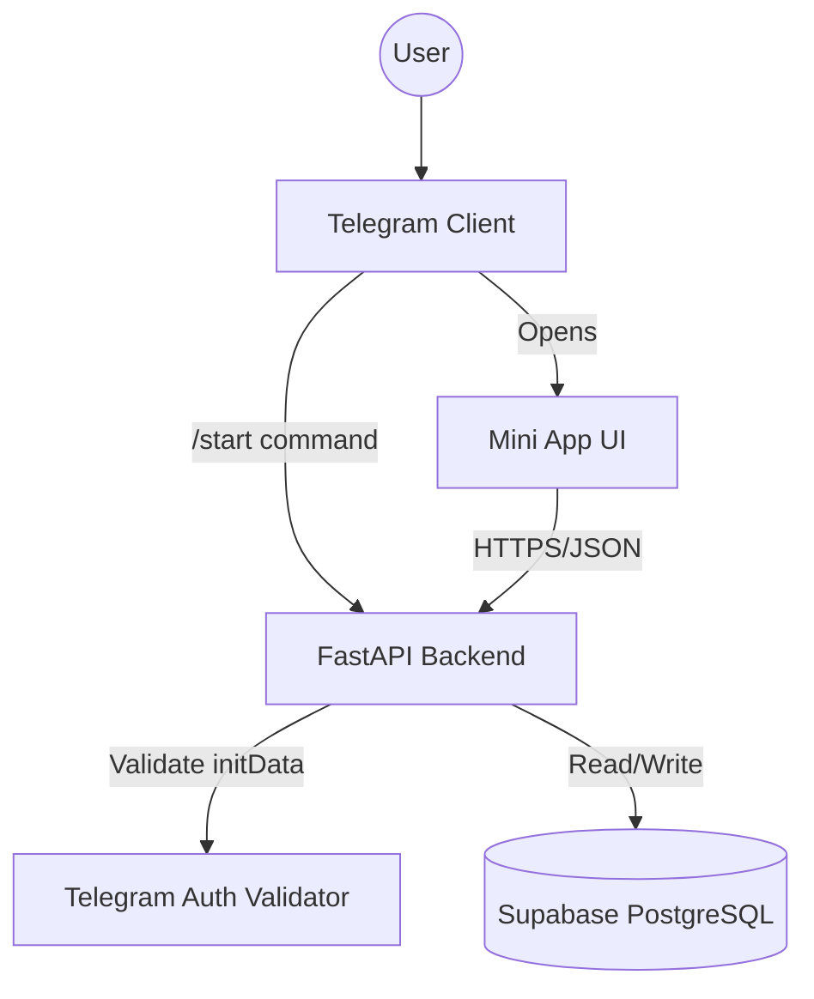
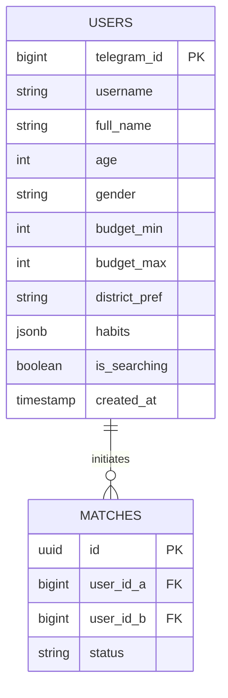

# 🏗 Technical Specification: Hamxona (Tashkent Flatmate Finder)

## 🏛 Architecture

## 💾 Database Schema (ERD)

## 🛠 Tech Stack
- **Frontend:** Telegram Mini App (React + Vite + ShadcnUI)
- **Backend:** Python (FastAPI)
- **Database:** PostgreSQL (Supabase)
- **Infrastructure:** Docker / Railway or Render (PaaS)

## 🔌 API Endpoints
- `POST /api/v1/auth/login (Validate Telegram WebApp Data)`
- `GET /api/v1/users/me (Get Profile)`
- `PUT /api/v1/users/me (Update Profile)`
- `GET /api/v1/matches/candidates (Find potential flatmates)`
- `POST /api/v1/matches/connect (Send request to user)`

## 🚀 Implementation Plan
- [ ] 1. Setup Supabase project and apply SQL schema.
- [ ] 2. Initialize FastAPI project with SQLModel.
- [ ] 3. Implement Telegram 'initData' validation for stateless auth.
- [ ] 4. Create User CRUD and Profile update endpoints.
- [ ] 5. Implement basic matching logic (Budget overlap + Location).
- [ ] 6. Deploy to Render/Railway.
- [ ] 7. Create Telegram Bot via BotFather and link WebApp URL.
