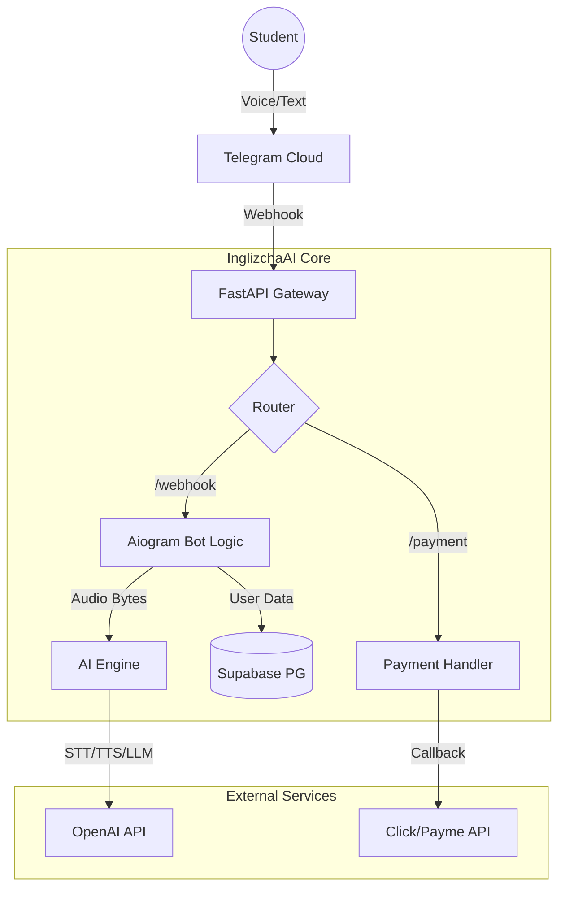
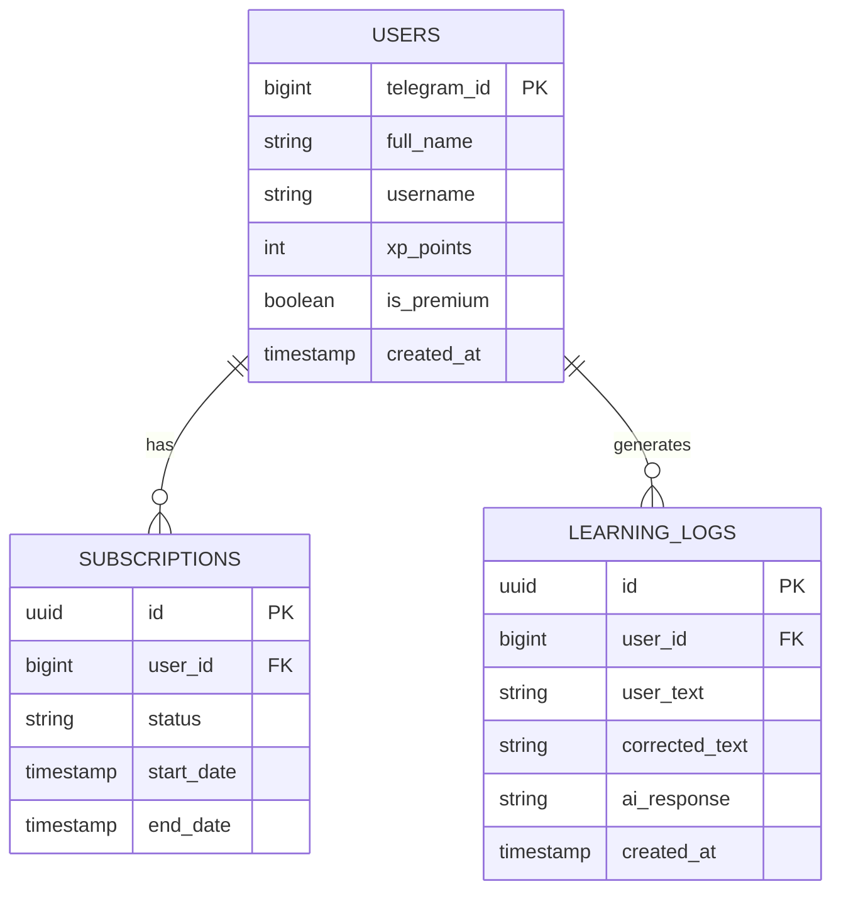

# 🏗 Technical Specification: InglizchaAI

## 🏛 Architecture

## 💾 Database Schema (ERD)

## 🛠 Tech Stack
- **Frontend:** Telegram Mobile App (Bot API)
- **Backend:** Python 3.11 (FastAPI + Aiogram 3.x)
- **Database:** PostgreSQL (Supabase)
- **Ai_engine:** OpenAI (Whisper for STT, GPT-4o-mini for Logic, TTS-1 for Voice)
- **Deployment:** Docker / Vercel / Railway

## 🔌 API Endpoints
- `POST /api/webhook/telegram (Receives updates from Telegram)`
- `POST /api/webhook/click (Receives payment success from Click)`
- `POST /api/webhook/payme (Receives payment success from Payme)`

## 🚀 Implementation Plan
- [ ] 1. Initialize Supabase project and apply SQL schema.
- [ ] 2. Set up Telegram Bot via BotFather and get API Token.
- [ ] 3. Configure OpenAI API keys.
- [ ] 4. Deploy FastAPI backend (src/main.py) to a server/cloud.
- [ ] 5. Set Telegram Webhook to point to the deployed URL.
