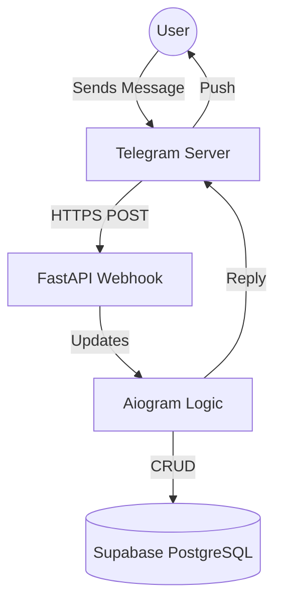
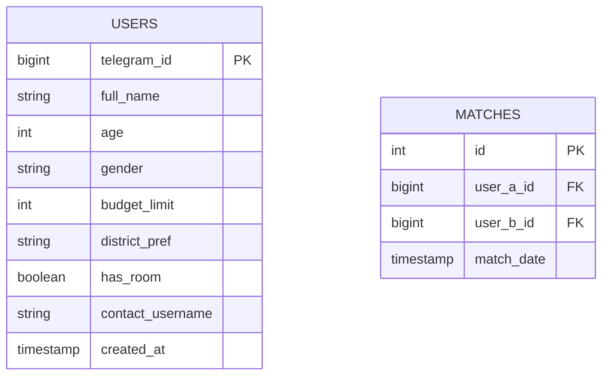

# 🏗 Technical Specification: SherikTosh

## 🏛 Architecture

## 💾 Database Schema (ERD)

## 🛠 Tech Stack
- **Frontend:** Telegram Interface (Aiogram 3.x)
- **Backend:** Python 3.11, FastAPI (Webhook Handler)
- **Database:** PostgreSQL (Supabase via AsyncSQLAlchemy)
- **Infrastructure:** Docker / Railway / Vercel

## 🔌 API Endpoints
- `POST /webhook (Telegram Update Entry)`
- `GET /health (Health Check)`

## 🚀 Implementation Plan
- [ ] 1. Set up Supabase project and get connection string.
- [ ] 2. Create Telegram Bot via BotFather and get API Token.
- [ ] 3. Deploy FastAPI app to a public URL (Railway/Render).
- [ ] 4. Set Webhook URL via FastAPI on startup.
- [ ] 5. Users register via Bot State Machine.
- [ ] 6. Users click 'Find Match' to query DB for compatible profiles.
