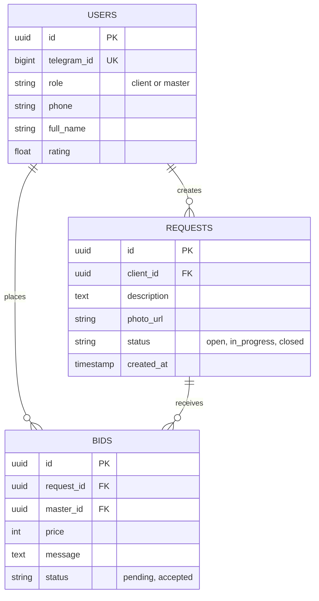

# 🏗 Technical Specification: TashkentPlumbFix

## 🏛 Architecture
```mermaid
graph TD
    User((Client/Master)) -->|Opens| TG[Telegram App]
    TG -->|Loads| WA[Telegram Mini App (React)]
    WA -->|API Calls| API[FastAPI Backend]
    API -->|Auth| TG_Auth[Telegram Validation]
    API -->|Read/Write| DB[(Supabase PostgreSQL)]
    API -->|Upload Photo| STORE[Supabase Storage]
    API -->|Notifications| TG_BOT[Telegram Bot API]
```

## 💾 Database Schema (ERD)


## 🛠 Tech Stack
- **Frontend:** Telegram Mini App (React + Vite)
- **Backend:** Python (FastAPI)
- **Database:** PostgreSQL (Supabase)
- **Storage:** Supabase Storage (for photos)
- **Auth:** Telegram initData (HMAC validation)

## 🔌 API Endpoints
- `POST /auth/login - Sync Telegram user to DB`
- `POST /requests - Create a leak report (Client)`
- `GET /requests - Feed of open leaks (Master)`
- `POST /requests/{id}/bid - Place a bid (Master)`
- `POST /bids/{id}/accept - Accept a bid (Client)`

## 🚀 Implementation Plan
- [ ] 1. Setup Supabase project and run SQL schema.
- [ ] 2. Create Telegram Bot via BotFather to get Token.
- [ ] 3. Deploy FastAPI backend to Render/Railway.
- [ ] 4. Develop React frontend handling Telegram WebApp.initData.
- [ ] 5. Connect frontend to FastAPI endpoints.
